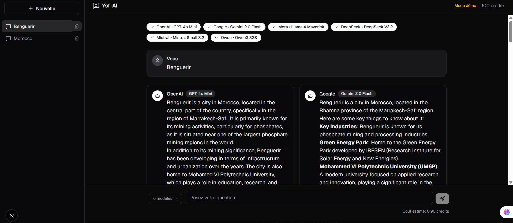
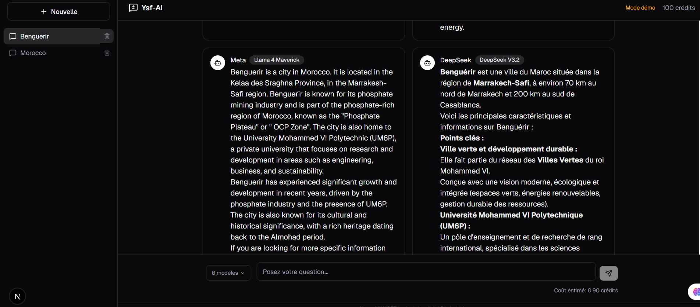
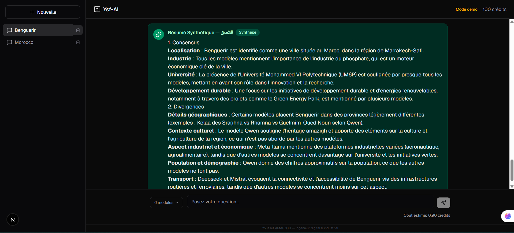

# 🤖 Ysf-AI — Plateforme Multi-Modèles IA

**Ysf-AI** est une plateforme web centralisée qui permet d'interroger **simultanément plusieurs grands modèles de langage (LLMs)** et de générer automatiquement une **synthèse comparative** mettant en évidence les points d'accord et de divergence entre les modèles.

---

## 📋 Sommaire

- [Problématique](#-problématique)
- [Solution](#-solution)
- [Architecture Technique](#️-architecture-technique)
- [Fonctionnalités](#-fonctionnalités)
- [Captures d'écran](#-captures-décran)
- [Prérequis](#-prérequis)
- [Installation](#-installation)
- [Configuration](#-configuration)
- [Utilisation](#-utilisation)
- [Structure du Projet](#-structure-du-projet)
- [Déploiement](#-déploiement)
- [Feuille de Route](#-feuille-de-route)
- [Licence](#-licence)

---

## 🎯 Problématique

La consultation individuelle de plusieurs LLMs pour des décisions complexes est **chronophage** :

- L'utilisateur doit copier-coller les mêmes prompts dans chaque interface
- Comparer manuellement les réponses entre différents modèles
- Gérer des fils de discussion fragmentés sur plusieurs plateformes
- Aucune vue d'ensemble des consensus et divergences

## 💡 Solution

Une plateforme **unifiée** offrant :

- **Interrogation parallélisée** : un prompt, plusieurs modèles, une seule interface
- **Streaming simultané** : visualisation en temps réel des réponses de chaque modèle
- **Synthèse automatique** : un agent IA dédié analyse et compare l'ensemble des réponses
- **Gestion de contexte** : possibilité de poser des questions de suivi (follow-up) conservant l'historique

---

## 🏗️ Architecture Technique

```
┌─────────────────────────────────────────────────────┐
│                    Frontend                          │
│              Next.js 16 (App Router)                  │
│         TypeScript + Tailwind CSS v4                  │
│                Lucide Icons                           │
├─────────────────────────────────────────────────────┤
│              Backend & Database                       │
│     ┌─────────────────────────────────────────┐      │
│     │              Convex                      │      │
│     │  (Backend-as-a-Service + DB temps réel)  │      │
│     │  ┌─────────┐ ┌──────────┐ ┌──────────┐  │      │
│     │  │Queries  │ │Mutations │ │ Actions   │  │      │
│     │  │(lecture)│ │(écriture)│ │(API ext.) │  │      │
│     │  └─────────┘ └──────────┘ └──────────┘  │      │
│     └─────────────────────────────────────────┘      │
├─────────────────────────────────────────────────────┤
│             Services Externes                         │
│  ┌──────────┐ ┌──────────┐ ┌──────────┐             │
│  │OpenRouter│ │  Stripe  │ │ PostHog  │             │
│  │(API IA)  │ │(Paiement)│ │(Analytics)│            │
│  └──────────┘ └──────────┘ └──────────┘             │
└─────────────────────────────────────────────────────┘
```

### Stack

| Catégorie | Technologie | Rôle |
|-----------|------------|------|
| **Frontend** | Next.js 16 (App Router) | Interface utilisateur, Server Components |
| **Styling** | Tailwind CSS v4 | Design system, responsive |
| **Backend/DB** | Convex | Base de données temps réel, mutations, queries |
| **Auth** | Convex Auth | OAuth GitHub/Google |
| **API IA** | OpenRouter | Gateway multi-modèles (Claude, GPT, Gemini, etc.) |
| **Paiement** | Stripe | Abonnement et crédits (à venir) |
| **UI Icons** | Lucide React | Iconographie |
| **Markdown** | React Markdown | Rendu des réponses formatées |

### Modèles Disponibles

| Modèle | Fournisseur | Coût (crédits) |
|--------|------------|:--------------:|
| GPT-4o Mini | OpenAI | 0.15 |
| Gemini 2.0 Flash | Google | 0.10 |
| Llama 4 Maverick | Meta | 0.20 |
| DeepSeek V3.2 | DeepSeek | 0.20 |
| Mistral Small 3.2 | Mistral | 0.10 |
| Qwen3 32B | Qwen | 0.15 |

---

## ✨ Fonctionnalités

### ✅ Implémentées

- **Sélection multi-modèles** : cochez/décochez les modèles souhaités avant d'envoyer un prompt
- **Requêtes parallélisées** (Fan-out) : envoi simultané du prompt à tous les modèles sélectionnés
- **Streaming en temps réel** : affichage des réponses au fur et à mesure de leur génération
- **Résumé Synthétique** (اللاصق) : rapport consolidé avec consensus et divergences
- **Questions de suivi** : conservation du contexte pour des échanges multi-tours
- **Historique des conversations** : sidebar avec l'ensemble des échanges
- **Suppression de conversations** : nettoyage de l'historique
- **Mode démo** : utilisation sans authentification (réponses simulées)
- **Authentification OAuth** : GitHub et Google
- **Calcul du coût estimé** : avant envoi du prompt
- **Gestion d'erreurs** : échec d'un modèle sans bloquer les autres
- **Rendu Markdown** : formatage des réponses (code, listes, etc.)

### 🗓️ À Venir

- Streaming réel (au lieu de `stream: false`)
- Abonnement Stripe et crédits
- Analytics PostHog
- Export des conversations
- Mode sombre / clair
- Comparaison côte à côte améliorée

---

## 📸 Captures d'écran

| Page d'accueil | Dashboard | Résumé |
| :---: | :---: | :---: |
|  |  |  |

---

## 📦 Prérequis

- **Node.js** 18+
- **pnpm** (recommandé) ou npm/yarn
- **Compte OpenRouter** (pour les vraies réponses IA)
- **Compte GitHub/Google** (pour l'authentification OAuth)

---

## 🚀 Installation

```bash
# 1. Cloner le dépôt
git clone https://github.com/Youssef-AMARZOU/lasqAI.git
cd lasqAI

# 2. Installer les dépendances
pnpm install

# 3. Configurer les variables d'environnement
cp .env.example .env.local
```

---

## 🔧 Configuration

Éditez `.env.local` avec vos clés :

```env
# Connexion à Convex (généré automatiquement)
NEXT_PUBLIC_CONVEX_URL=http://127.0.0.1:3210

# OAuth (optionnel pour le mode démo)
AUTH_GITHUB_ID=votre_id_github
AUTH_GITHUB_SECRET=votre_secret_github
AUTH_GOOGLE_ID=votre_id_google
AUTH_GOOGLE_SECRET=votre_secret_google

# OpenRouter (obligatoire pour les vraies réponses)
OPENROUTER_API_KEY=sk-or-v1-...

# Stripe (optionnel - paiements)
STRIPE_SECRET_KEY=...
NEXT_PUBLIC_STRIPE_PUBLISHABLE_KEY=...
```

### Obtenir une clé OpenRouter

1. Créez un compte sur [openrouter.ai](https://openrouter.ai/keys)
2. Générez une clé API
3. Ajoutez-la dans `.env.local`
4. Configurez-la dans Convex :

```bash
npx convex env set OPENROUTER_API_KEY sk-or-v1-...
```

---

## 🏃 Utilisation

```bash
# Terminal 1 : Démarrer Convex (base de données locale)
npx convex dev

# Terminal 2 : Démarrer Next.js
pnpm dev
```

Ouvrez [http://localhost:3000](http://localhost:3000) dans votre navigateur.

### Workflow

1. **Sélectionnez les modèles** à interroger (cliquez sur les badges)
2. **Posez votre question** dans le champ de saisie
3. **Observez les réponses** en temps réel dans des fenêtres distinctes
4. **Consultez le résumé synthétique** généré automatiquement
5. **Posez des questions de suivi** pour approfondir

---

## 📁 Structure du Projet

```
lasqAI/
├── convex/                          # Backend Convex
│   ├── schema.ts                    # Schéma de la base de données
│   ├── auth.ts                      # Configuration Convex Auth
│   ├── auth.config.ts               # Providers OAuth
│   ├── mutations/                   # Fonctions d'écriture
│   │   ├── conversations.ts         # CRUD conversations
│   │   └── messages.ts              # CRUD messages
│   ├── queries/                     # Fonctions de lecture
│   │   ├── conversations.ts         # Liste et détails conversations
│   │   └── messages.ts              # Messages d'une conversation
│   ├── actions/                     # Actions externes (Node.js)
│   │   └── models.ts                # Appels API OpenRouter + synthèse
│   └── _generated/                  # Types générés automatiquement
├── src/
│   ├── app/                         # Pages Next.js (App Router)
│   │   ├── layout.tsx               # Layout racine
│   │   ├── page.tsx                 # Page d'accueil
│   │   ├── dashboard/               # Dashboard principal
│   │   │   ├── page.tsx             # Import dynamique
│   │   │   └── dashboard-content.tsx # Composant dashboard
│   │   └── globals.css              # Styles globaux
│   ├── components/
│   │   ├── core/                    # Composants UI réutilisables
│   │   │   ├── button.tsx
│   │   │   ├── card.tsx
│   │   │   ├── input.tsx
│   │   │   ├── badge.tsx
│   │   │   └── index.ts
│   │   ├── auth/                    # Authentification
│   │   │   └── signin-page.tsx
│   │   ├── chat/                    # Composants de chat
│   │   │   ├── chat-area.tsx        # Zone de chat principale
│   │   │   ├── model-selector.tsx   # Sélecteur de modèles
│   │   │   ├── message-bubble.tsx   # Bulle de message
│   │   │   └── summary-card.tsx     # Carte de résumé
│   │   ├── sidebar/                 # Navigation
│   │   │   └── sidebar.tsx          # Sidebar historique
│   │   └── providers.tsx            # Providers Convex
│   └── lib/
│       ├── utils.ts                 # Utilitaires (cn)
│       ├── models.ts                # Configuration des modèles IA
│       └── use-safe-auth.ts         # Hook auth sécurisé
├── AGENTS.md                        # Contexte pour IA générative
├── .env.example                     # Exemple de variables d'env
└── README.md                        # Ce fichier
```

---

## 🌐 Déploiement

### Convex (Production)

```bash
npx convex deploy
```

### Next.js (Vercel)

```bash
vercel --prod
```

Définissez les variables d'environnement dans le dashboard Vercel :
- `NEXT_PUBLIC_CONVEX_URL` (l'URL de déploiement Convex)

---

## 🗺️ Feuille de Route

- [ ] Streaming réel (SSE) des réponses
- [ ] Abonnement Stripe avec crédits
- [ ] Analytics PostHog
- [ ] Mode sombre / clair
- [ ] Export PDF des conversations
- [ ] Partage de conversations
- [ ] Comparaison côte à côte améliorée
- [ ] Support des images (vision)
- [ ] Mode offline / PWA

---

## 👨‍💻 Auteur

**Youssef AMARZOU** — Ingénieur Digital & Industriel

---

## 📄 Licence

 Voir le fichier `LICENSE` pour plus de détails.
